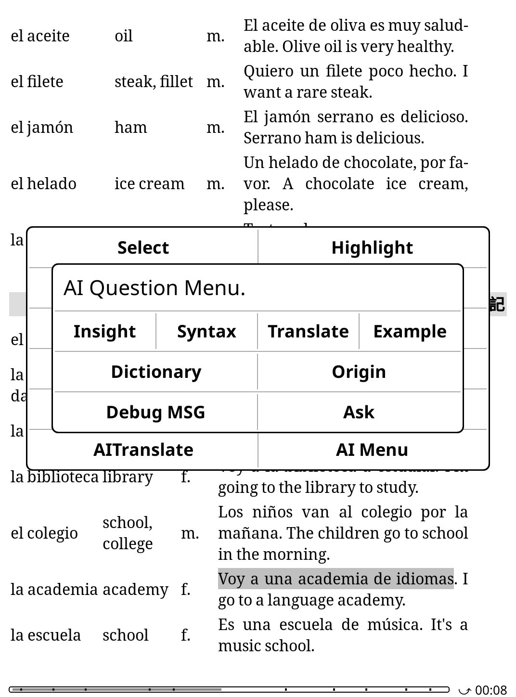
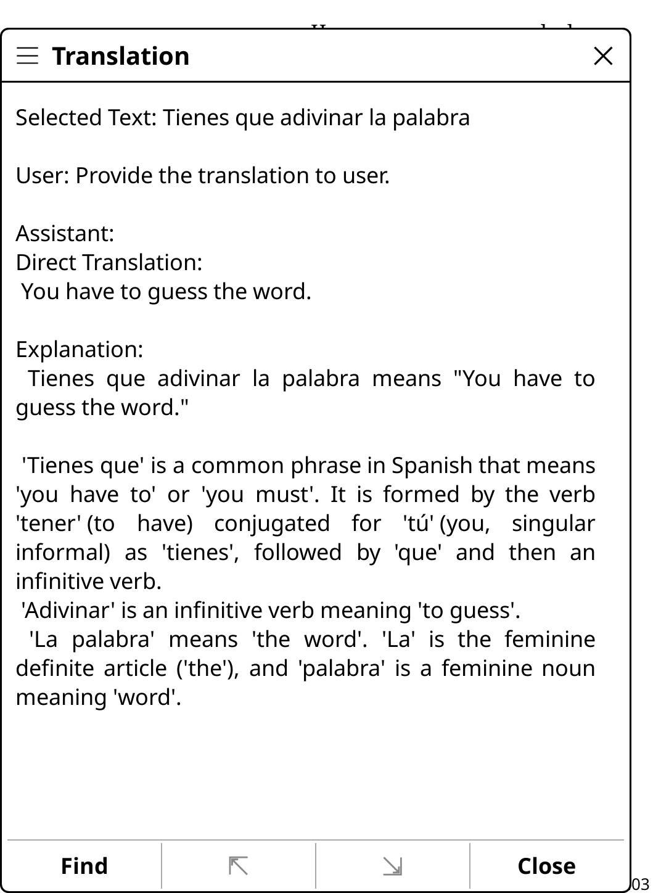
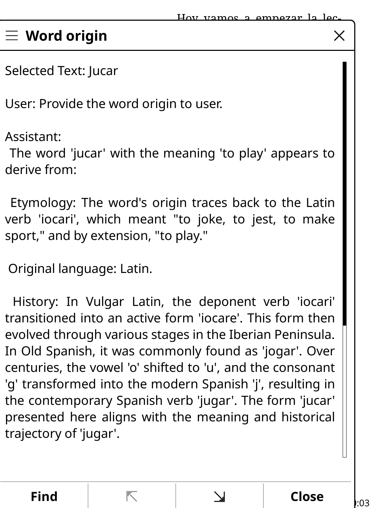

# AILearning KOPLUGIN

AILearning is a KOPLUGIN for Kindle devices that integrates AI-powered learning assistance directly into your reading experience. It allows you to interact with highlighted text and dictionary lookups using various AI models, including custom servers and Ollama.

## Screenshot
| Main Menu | Translation | Word Origin |
| :-------: | :---------: | :---------: |
|  |  |  |

## Features

*   **AI Menu Integration:** Access a dedicated AI menu from the highlight dialog for various AI actions.
*   **Dictionary Popup Integration:** Get AI-powered insights like "Word Origin" and "Dictionary" definitions directly from the dictionary popup.
*   **Configurable AI Backends:**
    *   Support for a main AI server (e.g., OpenAI, custom API).
    *   Support for Ollama for local AI models.
    *   Support for multiple user-defined AI servers.
    *   Toggle between main server, Ollama, and user-defined servers directly from the main menu.
*   **Multiple AI Question Types:** The plugin offers various AI-powered question types to enhance your learning:

| Question Type   | Description                                                               |
| :-------------- | :------------------------------------------------------------------------ |
| **AI Menu**     | Provides a comprehensive menu for various AI interactions.                |
| **AI Translate** | Explains and translates highlighted text.                                 |
| **Word Origin** | Explains the etymology of a word.                                         |
| **Dictionary**  | Provides a dictionary entry for a word, highlighting its meaning in context. |
| **Syntax Analysis** | Analyzes sentence structure.                                              |
| **Insight**     | Provides deeper insights into author's choices and cultural contexts.     |
| **Examples**    | Generates example sentences based on highlighted text.                    |
*   **Customizable Language:** Set the target language for AI responses.
*   **Configuration Management:** Load, save, and modify plugin settings directly from the KOPLUGIN menu.

## Installation

1.  **Download:** Obtain the `ailearning.koplugin` directory.
2.  **Copy to Kindle:** Copy the entire `ailearning.koplugin` directory into your Kindle's `koreader/plugins` directory.
3.  **Configuration File:** The plugin will automatically create a default configuration file at `/mnt/us/koreader/data/ailearning.json` on first run or when you save configs from the menu.

## Configuration

The plugin's settings are stored in `/mnt/us/koreader/data/ailearning.json`. You can edit this file directly or use the "Configs" menu within the plugin.

Models: The following models have been tested and demonstrated excellent performance.

| Provider   | Model                 |
| :--------- | :-------------------- |
| openrouter | deepseek-r1t2-chimera |
| openrouter | qwen3-coder           |
| google     | gemini-2.5-flash      |
| google     | gemini-2.5-pro        |


**Important:** The configuration has been refactored. Please review the updated `ailearning.json` structure below.

Here's an example of the `ailearning.json` structure:

```json
{
  "language":"English",
  "ollama":{
    "enable":false,
    "api_key":"ollama",
    "server_url":"http://127.0.0.1:11434/v1/chat/completions",
    "model":"qwen3:1.7b"
  },
  "main":{
    "enable":false,
    "api_key":"your_api_key_here",
    "server_url":"https://api.example.com/v1",
    "model":"gpt-5"
  },
  "servers":{
    "example_server":{
      "enable":false,
      "api_key":"your_api_key_here",
      "server_url":"https://api.example.com/v1",
      "model":"example_model",
      "index": 0
    }
  },
  "log_level": 3
}

